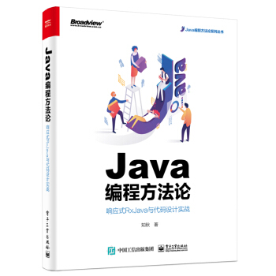
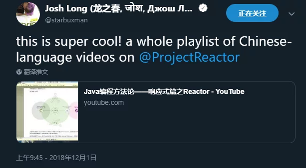
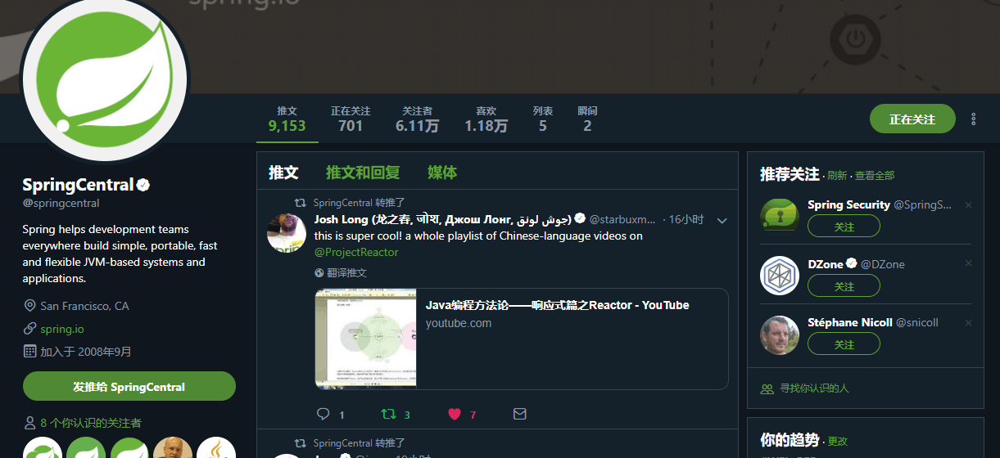

# SIMVISO 源码解读分享系列：

#### Java编程方法论-响应式篇-RxJava 分享视频 已完结 

相关书籍已出版：https://item.m.jd.com/product/12615848.html

书籍封面：

bilibili：https://www.bilibili.com/video/av34537840

油管:https://www.youtube.com/playlist?list=PL95Ey4rht798MMCusPzIW7VYD1xaKJVjc

[点此查看具体目录](./Java编程方法论-响应式 之 Rxjava篇 .md)

#### Java编程方法论-响应式篇-Reactor 分享视频 已完结

B站：<https://www.bilibili.com/video/av35326911>

油管：https://www.youtube.com/playlist?list=PL95Ey4rht7980EH8yr7SLBvj9XSE1ggdy

[点此查看具体目录](./Java编程方法论-响应式 之 Reactor篇.md)

#### Java编程方法论-响应式篇-Reactor-Netty 分享视频  在分享

相关博文：https://juejin.im/user/59c7640851882578e00ddf90/posts

视频分享：

B站：https://www.bilibili.com/video/av45556406/

油管：https://www.youtube.com/watch?v=6qLh2L75KdM&list=PL95Ey4rht79-ISlb_Yr9ToaEI0K8ARmH6

[点此查看具体目录](./Java编程方法论-响应式 之 Reactor-Netty篇.md)

#### Java编程方法论-JDK 篇 之 NIO 分享视频  在分享

相关博文：https://juejin.im/user/59c7640851882578e00ddf90/posts

B站：https://www.bilibili.com/video/av43230997

油管：https://www.youtube.com/watch?v=ZZnCI8xaTRo&list=PL95Ey4rht799NVLgQiSV9skTqY6VuspIk

[点此查看具体目录](./Java编程方法论-JDK 篇 之 NIO.md)

#### Java编程方法论-JDK 篇 之 JUC 分享  待上传

[点此查看具体目录](./Java编程方法论-JDK 篇 之 JUC.md)

#### Java编程方法论-Netty篇  在分享

B站：https://www.bilibili.com/video/av50169264

油管：https://www.youtube.com/watch?v=AHNW9YCF9aI&list=PL95Ey4rht798WiqkvGYChWdUtHie0j-IU

[点此查看具体目录](./Java编程方法论-Netty篇.md)

#### simviso出品国外顶级开发者分享视频翻译

[点此查看具体目录](./simviso出品国外顶级开发者分享视频翻译.md)

#### Spring 源码解读博客文章：

https://muyinchen.github.io/tags/Spring/

#### 后端圈技术问题解答精华集锦，不定期更新中

[点此查看具体](./simviso出品国外顶级开发者分享视频翻译.md)

**其中Spring Reactor 分享视频获得了Spring 开发者的认可并被Spring官方推特转发：**

所有直播分享均在QQ群进行，同时也欢迎大家加群提出建议：

响应式编程交流QQ群:

 

应一些小伙伴的要求，加个赞赏途径，谢谢大家的支持（捐助请留言自己的昵称博客，我会在单独的一个页面内进行展示）：

