##  特别说明

这是一个由simviso团队进行的关于架构演进的云原生分享的翻译文档，这个主要是关于Service Mesh 的分享，分享者是Kong这家公司的CTO,https://github.com/Kong/kong
让 我们一起来学习下这家CTO是如何从单体应用架构过渡到微服务架构的，Kong又做了哪些事，K8S在其中又做了什么角色，什么是状态机（基于事件架构得到一种设计），在这个过程中又会遇到哪些坑，哪些经验，尽在视频分享中

**视频地址**：

[【国外前沿技术分享-云原生专题-中文字幕】从单体应用到微服务的开发旅程-上](https://www.bilibili.com/video/av60528090/)

[【国外前沿技术分享-云原生专题-中文字幕】从单体应用到微服务的开发旅程-下](https://www.bilibili.com/video/av61722230)

视频翻译文字版权归 **simviso**所有：

顺带推荐一个专业的程序员后端微信群的圈子：

## 前言

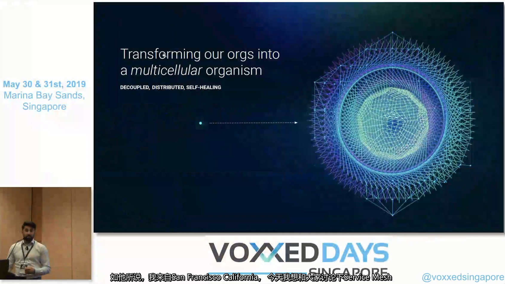

我叫Marco Palladino，我是Kong的创始人，同时也是这家公司的CTO

如他所说，我来自San Francisco California， 今天我想和大家讨论下Service Mesh

为了打造出适合现代化的架构体系，我们的架构组织采用了Service Mesh来做过渡

我想说的是，当我们的企业变大并通过拆分变成分布式管理之后，那这个企业组织就会变得像多细胞生物一样复杂
（由一个单细胞的形式分裂成多细胞进行协作，整体上看去还是这一个生命体）

事实上，无论是我们的团队还是软件，一旦复杂了，都会去做解耦并进行分布式化管理

可以想象一下，在使用service mesh实现架构现代化的过程中，它不仅仅只是技术采用这么简单

我们的软件开发方式也因为以下三个方向而发生着改变

其中一种是技术上的更新换代

第二种是组织结构上的过渡

所以架构组织该如何去改变才能去应对新的微服务架构

也就是说，我们之前对单体架构系统所做的操作模式必须进行改变。即我们不能以之前的方式去部署，扩展，版本化和文档化这个全新的微服务架构

这三个方向正在改变我们开发软件的方式

随着docker和kubernetes在2013和2014年的先后发布，一场真正的软件革命也就开始了

Docker和 kubernetes为我们提供了一种全新的创建应用的方式
随着时间的推进，基于它们，我们可以以更好的方式来对这些应用进行拓展
不仅仅是从技术上带来的好处，更重要的是可以作为我们业务拓展的首选

事实上除了技术层面，在这场演讲中我会来谈下我们想要实现的业务目标

如果我们不能在实现业务目标的同时协调新技术的使用，那么我们也就没办法在技术转型上走下去

在这个过程中，我们必须变得更加务实才行

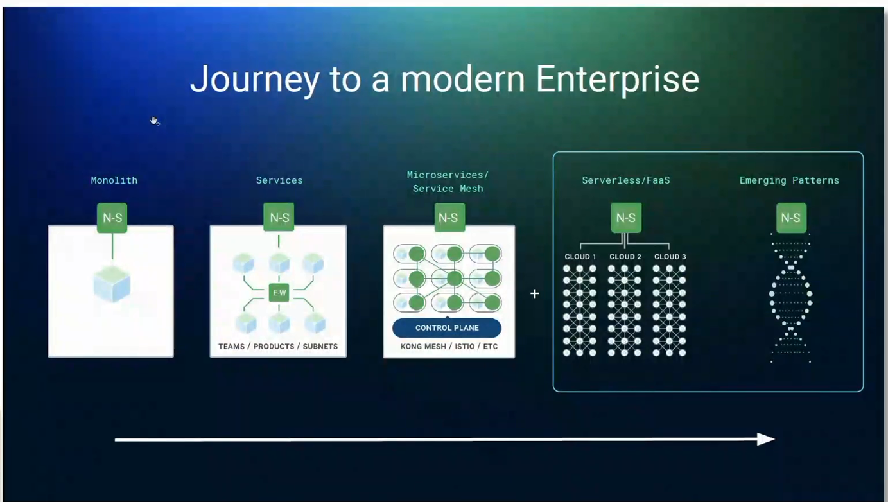

这是一个从单体架构服务到聚合服务（比如Maven多模块）再到微服务化的过程 Service Mesh就好像一个口袋
口袋里装了一堆的糖果，每个糖果都是一个微服务，每一个微服务可能是我们正常实现的服务，也有可能是由函数式实现的服务

同时，API也会改变它们在我们系统中的角色

我们通常以API为粒度进行APM（Application performance monitoring）性能监控管理。
自从2007-2008年移动端问世起，我们需要一种方式去和我们单体应用进行交互。于是我们才有了north-south traffic（南北交换，通常指多端与服务器之间的数据交互，也就是说我们可以通过外部开发者或移动端APP或外部其他形式来访问服务器，重点是外部）

我们要对我们的软件进行功能解耦，此时API在我们的系统中扮演的角色也就越来越重要

East-west traffic（东西交换，和上面相比，重点是内部），这个通常是指我们不同团队所开发的系统以及不同系统产品之间所产生的数据交互
接下来，我们将讨论使用 Service Mesh来对数据层和控制层进行分离，以此来不断的优化扩展我们的系统

## 过渡微服务的一些相关要点

### 1 What does it mean?

但退一步来讲，从务实的角度出发，为什么要用Service Mesh来进行微服务的过渡

我们重构单体应用的目的是可以释放团队生产力以及提高业务的可扩展性

此时整个过渡的关键在于团队生产力以及相关业务的可扩展性

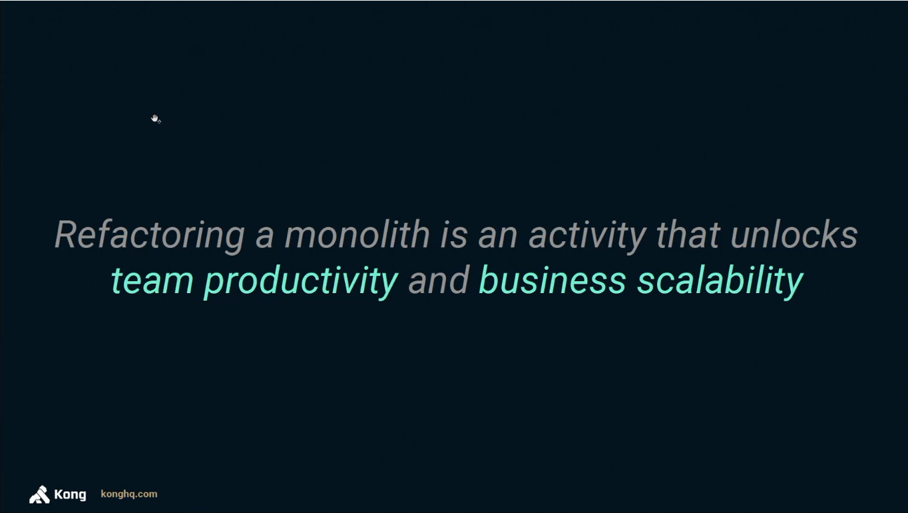

在向微服务过渡的过程中，如果我们没有做到这两者中的任何一点，那可以这么说，我们在做的不过是依葫芦画瓢
所以在做这个事之前我们必须扪心自问，我们到底是在为生产而使用，还是为了用这个技术而用

在这个过程中，业务应该是首要驱动力，因为我们写项目的目的就是为了实现业务目标
在确定业务策略然后采用微服务架构来实现，接下来，我们要确定从什么时候开始，更重要的是到什么时候结束

### 2 should we do it？

接下来第二个问题，也是那些想要将项目转向微服务的人想要问的
我们是否应该这么做，是否应该转向微服务，是否应该放弃现在原有的架构？

从技术趋势而言，我们不得不问自己，一项技术，我们是基于实际需要采用，还是因为这个技术很成熟才去采用

过渡到微服务的过程，这可要比跑单体应用复杂得多。它难就难在一个系统包含了所有的功能，然后我们将其裂变成一群具有单一功能的系统

目前而言，我们现在几乎不再以同一种方式部署或者扩展大型单体应用
但我们可以通过将一个完整的系统拆分成成百上千个具有不同功能的单体系统来实现原本的功能

如果说目前微服务无法去解决我们在管理单体应用上的问题，那么它就会使情况变得更加糟糕

因此技术架构和团队成员必须足够成熟，才能确实的去解决存在的问题

事实上，我真的很推荐在这个过程中采取步步为营的方式过渡到微服务

基于以下几个理由。首先，通过一步步的去实现阶段性的目标，这能增长团队的信心让他们觉得这件事他们可以驾驭
同时，我们在这个过程中也可以去适应并随时改变我们的流程

同时，业务领导者也会随着过渡而变得越发自信，因为整个过渡是朝着正确的方向进行，随着时间的推移来扩展和让业务变得更加与时俱进

事实上，当我们来看微服务，来看那些大公司例如Netflix，或者Amazon
它们其实很早之前就已经转型微服务，甚至那时候kubernetes和docker都不存在

到底是什么在驱动这些公司去做这样的转型？

就拿Netflix而言，为了扩展它的业务规模并不再拘泥于一个国家和单一的用户体系，它想向全世界迈进，所以它改变了

所以这也是他们的商业目标

对于想要达成的业务需求而言，他们之前的架构并不能满足。因此他们转向了微服务架构以满足业务需求

Amazon同样如此，因为它不单单满足于卖一种东西，它更倾向于商品的多元性，因此架构的改变才能满足更为复杂的需要

因此微服务紧紧地围绕着这些业务需求。为了完成我们的目标
我们不能各自孤军奋战无论是开发团队或者是管理层。拿Amazon举例，它就是微服务的成功例子

那你们谁知道，是谁决定了让Amazon向微服务去转型？

Amazon CEO Jeff Bezos曾强制推行了六个原则，如果不遵从这些原则
那这些人就可以直接被炒了（这段话其实是讲02年贝佐斯对员工提出必须要遵守的原则性问题）

这种改变很难相信居然不是开发团队提出的，而是他们的CEO提出的改变

作为企业的领导者通过逐步的改变去完成目标，同时这样能让他们变得更加自信，这才是正确前进的方法

从上面的所有情况来看，为了达到目标，我们将要经历无数的艰难险阻

我们可以依据复杂性来决定微服务是大是小

事实上，这些微服务的大小都由业务本身需求所决定，适合就行

### 3 Let's do it!

但只有当我们觉得微服务是我们所需要的，同时我们所选择的路线也是正确的，那么我们才能继续转型

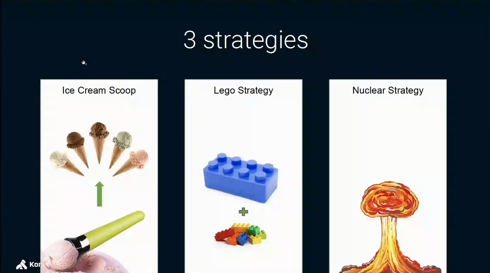

在转换到微服务的过程中 ，我定义了两种不同的策略
其中一种我称之为挖冰淇淋，如果有一大桶冰淇淋，就可以从中一勺勺的挖出你们想要的，
大桶冰淇淋可以挖出各自的服务和业务逻辑，然后就可以在不同的流程中单独执行和部署

第二种则是乐高法（搭积木），这意味着我们并不会完全摆脱原本的单体应用，这种通常适用于比较老旧的项目

但新的功能将会以新的架构进行打造

所以你必须找到一种能够让微服务与过去老的应用重新建立联系的方法，不然这将很难过渡

第三种我称之为nuclear法，这也意味着我们从头开始打造一切

在转型为微服务架构的过程中，我们需要去维护原本的单体应用

从向微服务转型的第一天开始起，我们就不能从零开始开发，因为它是最差的选择

这需要一支实力强劲的技术团队，同时也需要根据实际情况来确定技术边界
当你有两个不同的团队同时工作的时候，一个可以持续交付，另一个团队则将项目重构并微服务化

当我们重新构建这个新的代码库时，会将旧代码库的功能重构到新代码库中，这里
问题来了，我们该在哪里去创建新功能，因为此时我们的业务依然基于老代码库运行，并没有使用新代码库

也就是说，我们遇到了一个很复杂的情况，难以解决，所以，我们千万不要抛弃一切，从0开始。接下来就是我们今天要探讨的冰淇淋策略

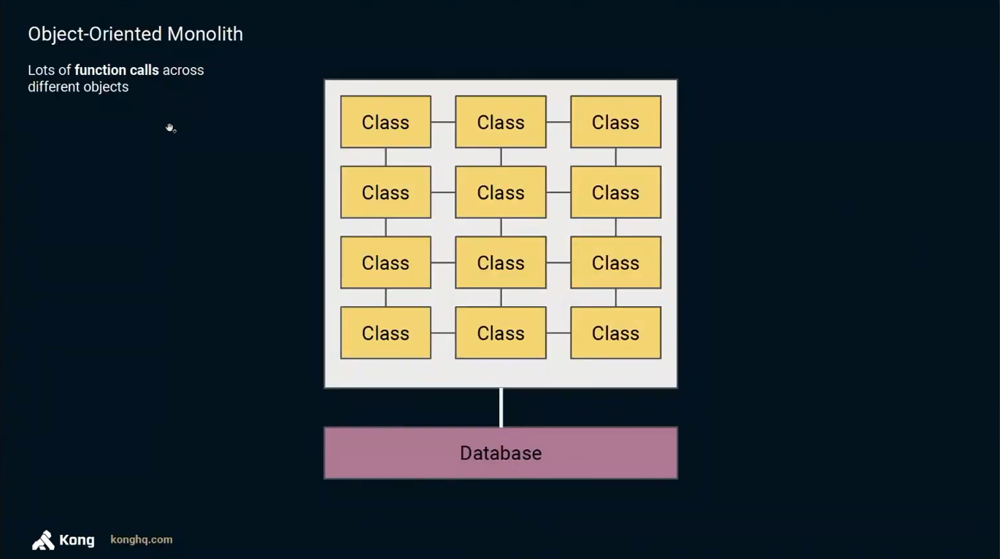

举个例子，我们有一个面向对象的单体服务架构，它具有我们所需要的所有的功能，这些功能通过不同对象和类在这个单体服务架构去交互实现

不同的服务共用了同一个数据库。如果想要扩展这个单体应用，那么我们只能部署更多这个单体应用的实例
（为了缓解某个扩展服务的压力，其他服务被动进行不必要的水平扩展，增加了复杂性）

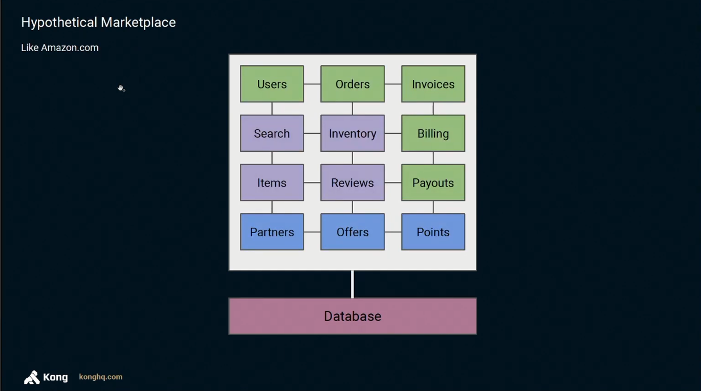

如果这个单体应用是个电商网站，比如我们常见的amazon.com，那我们会有很多不同的服务，比如用户管理，订单管理，库存管理，站内搜索等

这就是一个典型的单体服务架构案例，在这张图里，每个单独的方块代表了一个不同的业务逻辑

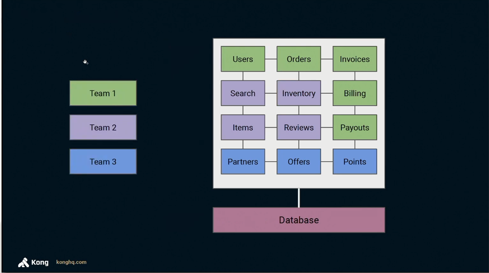

因为这是一个规模很大的单体服务架构，我们需要很多团队一起去维护它
在这个案例中，有三个不同的团队在对这个单体应用进行维护，为其创建新功能并将它们投入到生产环境中

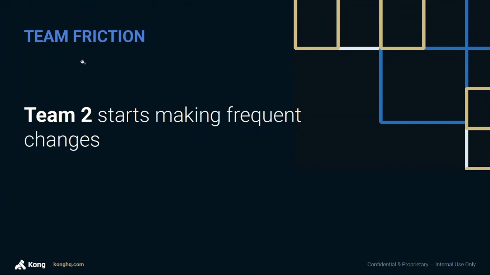

现在相信你们现在也知道了单体架构和微服务架构的一些利弊。在单体架构中，会出现一个问题
如果其中一个开发团队对其进行频繁的修改提交，那么就需要在其他团队之间进行大量的协调，以便在生产环境中正确部署这些改变

随着代码库变得越来越大，产品开发团队也同样如此。随着时间的推移，问题会变得越发严重。这会严重影响我们新版本发布周期的效率

当团队2（有多个团队一起开发）也开始频繁的变更代码的时候。遇到的问题更复杂，此时，我们该如何改变现状？

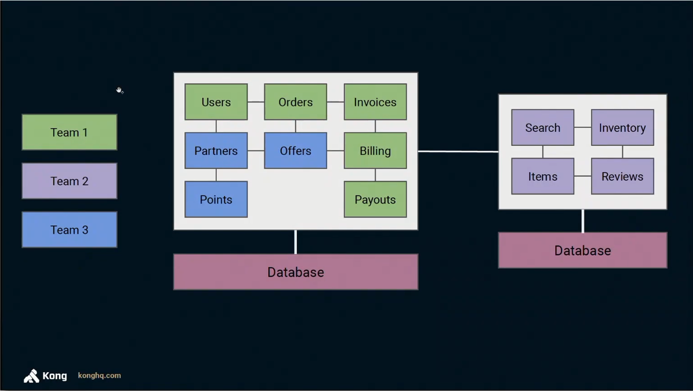

因为团队2在为搜索服务，库存以及其他模块进行开发工作，如果某个模块需要很多迭代，我们该怎样将这个模块抽取出来（进行单独开发）

所以我们所用的冰淇淋策略就是从单体架构中提取出业务逻辑，并将其独立出来

这些服务都非常重要，但它们并不是微服务。这就是今天我们需要做的工作即将它们逐渐改造成微服务

我们要确保所抽取出来的新服务能够不依赖原本老系统所使用的数据库

我们的初衷是希望所抽取的新服务真正的独立

如果老系统对数据库进行了过多的请求

那么数据库将变得不可用

因为我们不想让服务受到影响，所以我们想要对服务进行分拆和隔离

然后我们在生产环境下试运行，接着，当遇到一个或多个部分（这里指图中的方块）也需要进行大量修改的时候，指出并将它们抽取出来

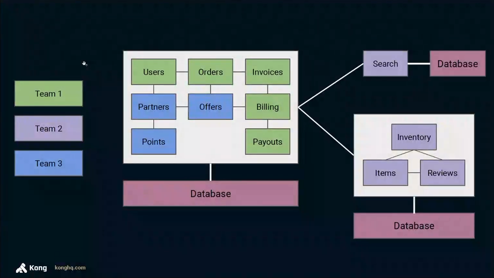

所以我们现在有三个不同的服务（如图所示），一个是我们的老系统，其次是一个稍大的服务，最后是一个小服务

从实际出发，通过一次又一次从单体应用中进行这种服务抽取的操作
或者是从已分离的服务中进一步抽取使之粒度变得更小，以此来解决我们当下所面临的问题

整个迭代过程不可能一次全部完成，我们只能以务实的态度去一步一步针对所抽取的业务进行敏捷开发

通过这种循序渐进的过程，我们可以顺带去修改这个项目组织中的其他相关逻辑

以此来给项目的后续迭代提供更多的解耦支持

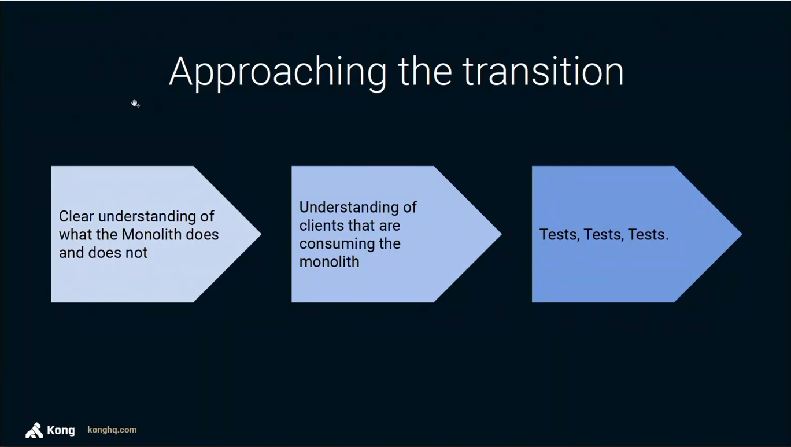

实际上，在过渡的过程中，这就是一个重构，类似于我们以前在单体服务架构内部进行服务的重构。在这我们有一些事需要去明确

第一件事，我们需要理解这个模型是什么。如果我们都不理解这些代码做了什么，那对我们而言就很难去确定服务边界

你们知道大部分的单体架构服务的逻辑都过于耦合。正因如此，我们才需要去明确服务边界并解耦服务
如果我们都不知道这些，那我们就根本不可能抽取出来

为了能够重构老系统，我们也需要去理解现在系统中使用的client，以及如果当错误发生时，会对客户端产生什么样的影响

在微服务转型前，我们需要知道哪些服务会受到影响

我们所以做的第三件事就是像其他所有重构一样，需要通过集成测试去验证我们想要修改的逻辑是否正确
以此来确保我们的重构不会对原本的系统产生影响

我们希望在不影响系统内部运行的情况下，来扩展我们的系统

我们不想要中断(影响）必要的服务，至少我们不能同时去扩展或者改变业务逻辑，这只能一步一步来

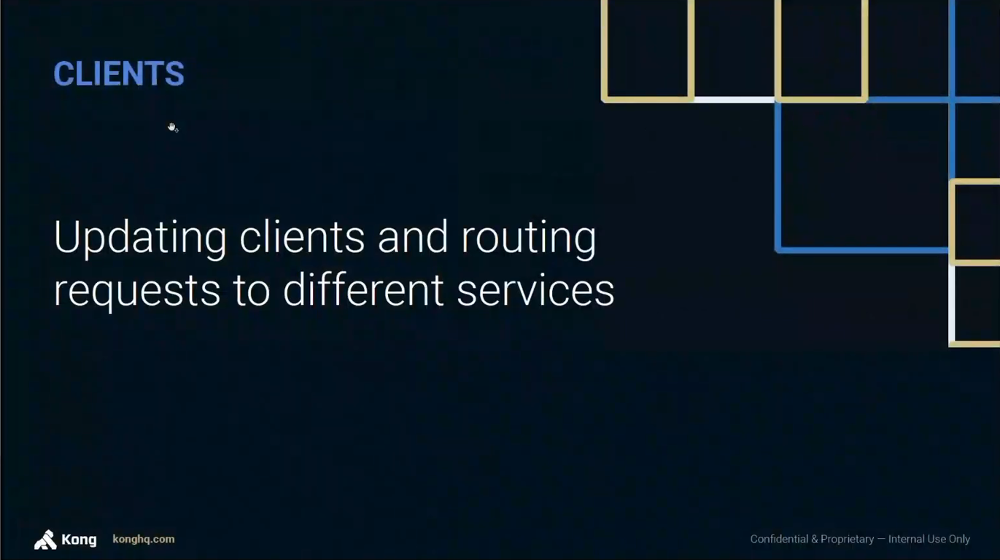

当老系统在运行时，有一些事情，可能就是一个小方法的改变，那么我们就没有必要去将它和之前一样去进行相同的扩展

比如，升级我们的客户端或者为了将请求正确路由到不同的服务而去更新路由

客户端会对我们的单体应用进行请求，但现在那些请求不再由我们的单体系统处理而是通过其他服务去处理。所以我们该如何重新路由这些请求？

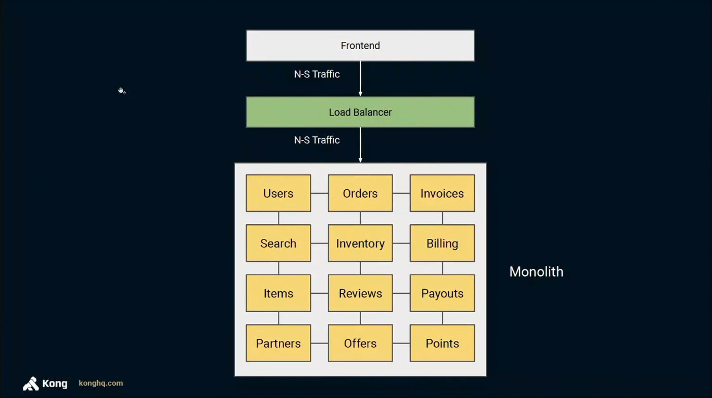

在传统业务模型中，我们会在客户端与服务端之间放置一个负载均衡器（比如nginx）

比如我们的客户端可以是个移动端程序，当我们部署单体系统的时候，我们只需在负载均衡器之后运行此应用的多个实例

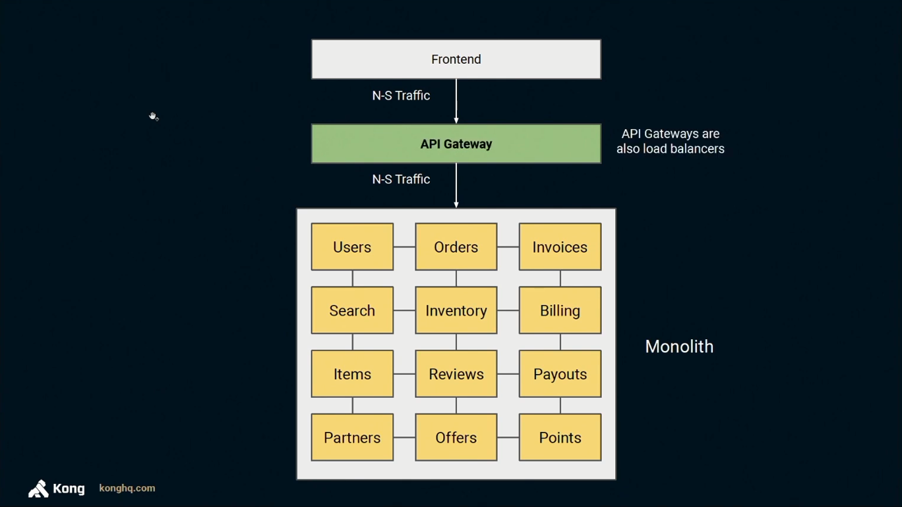

但随着我们系统一步步抽取解耦形成很多微服务，我们就需要将整个运行架构的某些方面更加智能化才行

首当其冲的一件事就是需要采用一个灵敏的API网关

如果这个网关能做到智能化负载均衡

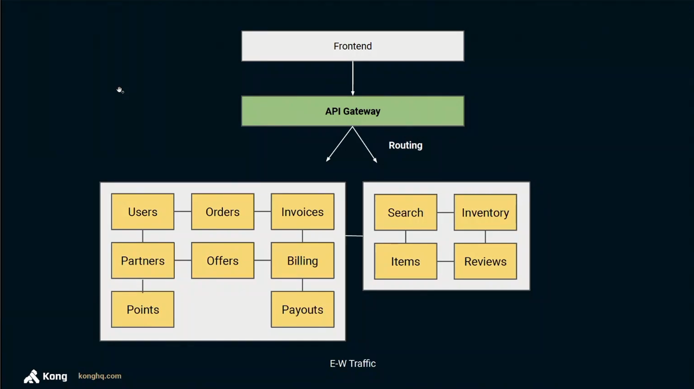

那么当我们解耦服务后，我们就能将API网关作为服务端与客户端之间的代理并实现功能路由。
这就可以使得我们无须升级客户端即可将请求路由到这些新的服务下。这对我们而言十分重要
如果我们不这么做，那就必须升级客户端，原有的版本就会出问题，客户体验就很差，也就说会对我们的业务产生很不好的影响

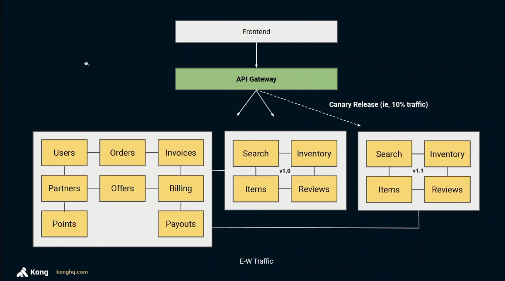

客户端到服务端之间的代理也就是网关，它必须足够智能化才能够帮助我们处理我们架构上的一些操作
像我之前说的向微服务过渡，这并不仅仅是技术上的采用例如我们说的kubernetes，同时也是运营管理上的过渡

我们不能以部署单体应用的方式来部署微服务架构和SOA架构

我们需要通过一些策略来降低风险

比如，一个服务的新版本出来了，我们可以通过使用灰度发布的策略将10%的流量导向新版本的服务

只有当稳定了，我们才能将流量完全的导向新版本的服务上同时摆脱掉旧版本服务
与此同时我们也需要继续保持旧版本的运行，以防我们需要回滚到前一个版本

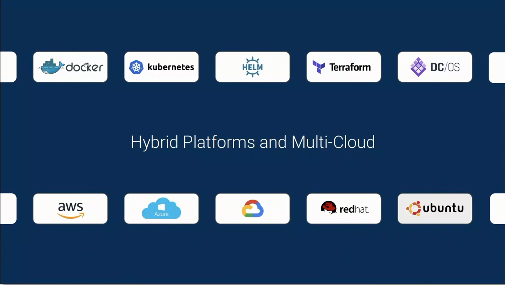

在深入探究微服务和service mesh之前，我想花点时间去阐述下hybrid和multi-cloud

当微服务化的时候，我们就需要采用像kubernetes这样的平台来运行我们的服务

因为我们还有不少服务还在老系统上运行，所以我们不会在kubernetes中运行所有的服务
我们仍然会将老系统在我们之前使用的平台运行，例如虚拟机

当我们计划向微服务转型的时候，我们必须制定一个策略来将新老应用平台进行一个有效的连接

我们没有办法在一夜之间将所有东西都运行在Kubernetes之上

所以，我们该怎么做才能将kubernetes上运行的服务和原本的老系统的相关依赖服务重新建立联系

就如我之前所说，这里将整个组织想象成一个复杂的人体组织
那么我们可以想到，不同的团队，产品以及业务需求，它们共同的目标都是（所开发的程序单元）要成为彼此独立的存在

从更高层次的角度来看，整个组织没必要非要用hybrid ，也没必要非要用Multicloud，这需要有一个自上而下的决定

一些公司的项目组织已经运行在不同的云平台上，之所以采用了hybrid 和 Multicloud
也就意味着随着时间的推移，这些不同的团队根据项目组织的需要选择了不同的云平台

从更高层次的角度来看这些公司的整个项目组织，它们为什么采用hybrid cloud,这已经不是因为他们想要用，而是他们不得不用

从理想的角度而言，我们想将所有的服务都放在同一个平台运行

但我们还是要面对现实，当下的情况是，我们需要将多个系统运行在各个地方
所以我们需要有一个抽象级别更高的架构，在这里我们需要有工具可以管理这个项目组织下的 Multicloud与hybrid

### 4 服务粒度

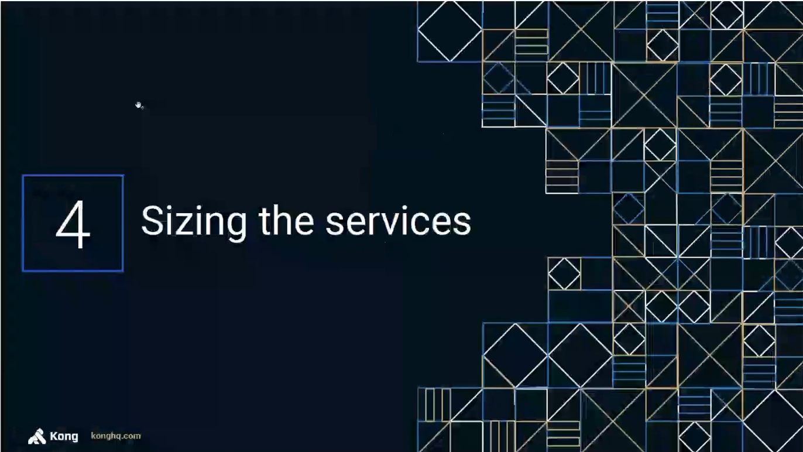

随着我们从这个单体服务架构中抽取出越来越多的微服务

我要给一条建议，结合当下的目标，以合理的方式来确定微服务边界
我认为是十分重要的。这是我在那些已经十分成功的抽取案例中所得到的经验

就像我之前的例子，我们不能将微服务化一步到位
我们可以将一个相对较大的服务抽取出来，然后随着时间的推移一步步解耦它，使之变得越来越小

当我们在看待Service mesh和微服务架构时，理想情况下，这些服务都应该是很小的
并且会以相同的方式互相连接起来。

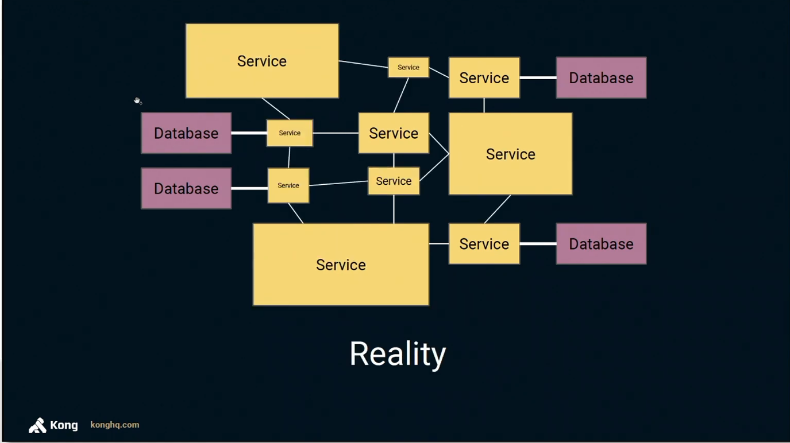

但现实是，这些服务的大小都取决于我们以最好的方式来达成的业务目标所产生的规模

我们不要为了追求微服务而强行使用微服务，有时候我们需要的可能是一个比较大的服务

### 5 网络

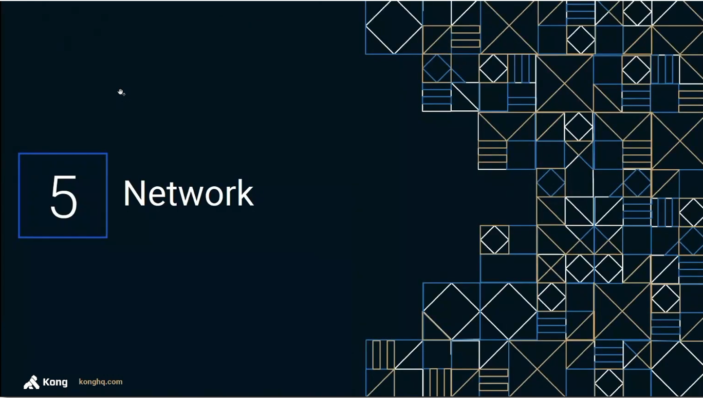

ok，现在我们通过解耦得到了很多微服务，这些解耦的微服务由不同的团队独立创建并独立部署
需要强调的是，这些服务不能单独存在，它们需要通过彼此交流才能运行

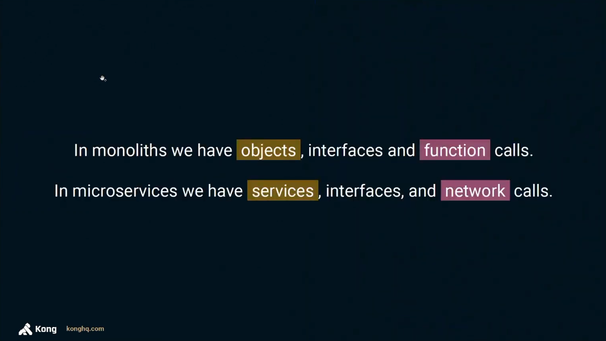

so，我们将放弃在单体应用中一些使用方式。我们基于代码库中的对象（这里的对象是指接口实现类，不是我们的POJO）
接口和函数调用，通过完美执行这些函数调用，我们可以调用和访问不同的对象

但是当我们将它们解耦成微服务时，这些接口实现类对象变成了服务

接口仍然存在，但所有微服务间的访问将通过网络来进行

举个例子，在一个Java单体应用中，当执行一个函数调用时（调用所定义接口中的方法）
因为底层是基于JVM，我们完全无须担心这个调用，它会被成功处理， java虚拟机将接收调用，并将该调用路由到正确的实现类中

但是在微服务中，我们将无法做到前面这种

因为我们将通过网络来进行函数调用，所以我们将无法保证这种函数请求会在网络中具体哪个地方进行调用

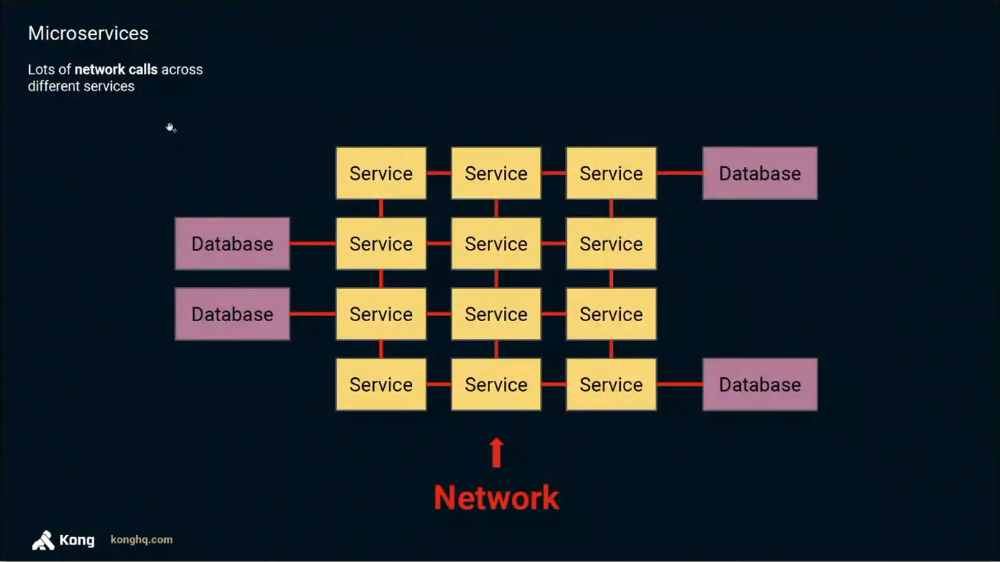

在我们的系统中，网络是一个非常不可靠的因素。网络可能会很慢，有延迟也有可能宕机
总之网络和单体应用层面不同的是它会有各种各样的问题来影响我们的系统服务

在微服务架构体系中，我们会有不同的团队来运行和部署这些服务

团队的思维方式也需要进行改变

在单体应用中，它有两种状态，工作或者宕机

但是在微服务中，任何时候，如果一个服务在运行过程中出现了问题
此时，我们应该改变思维方式，即这里应该有一个服务降级，也就是我们的架构中应该有服务降级这一部分

因为这些不同服务中的每一个都会出现问题，我们会创建的越多降级服务，团队可以将它们各自进行独立部署

同时，在组织结构上，我们的项目团队也要改变相应的思维模式

在某个时刻，服务一旦发生问题，服务降级系统必须制定该如何进行处理，同时为终端用户提供一个非常好的体验

为终端用户所做的这些所有事情，并不是为了我们自己，我们这么做是为了给终端用户提供一个更好的产品体验

## 延迟

接下来讲延迟，API 间调用产生的延迟我们我无法忽略

我们都知道，网络延时十分重要，对于传统的移动端到单体应用访问来说

如果移动端App访问我们的系统时延迟达到数百毫秒，这个对我们而言
状况并不乐观，我们可以通过CDN或者缓存来降低延迟，改善网络处理的速度

在微服务中，延时的产生是由于不同的微服务间的相互的请求越来越多，服务A在消费
服务B在消费，服务C也在消费，可以看到，这就会产生服务间相互调用的延时问题

在微服务中传输架构中，一旦一个基础服务发生了服务宕机,调用宕机服务的调用方也会因此而发生新的宕机
在一个单体的服务架构中，一旦一个服务产生异常则和它相关的调用都会发生异常

在微服务中，当产生响应超时，这会影响其他相关微服务，产生链式反应，情况就好像整个系统不再工作一样

所以延迟是我们需要去解决的首要问题，这不是我们事后想fix就fix的
就像安全和性能，这两个不是功能组件，我们没办法后续添加
我们只有在编写系统的时候时刻保持这个意识，如何写才能保证性能，如何写才能保证系统安全

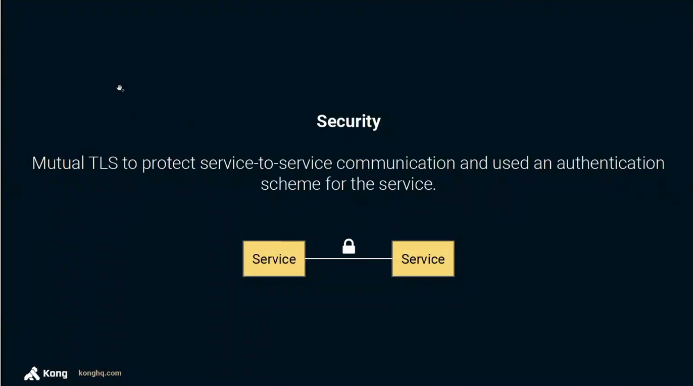

安全也成为其中的另一个组成部分（如图所示），所以现在我们在网络上拥有的所有这些通信，我们希望能够加密并保护这些交互

例如，通过强制实施双向TLS或者在不同服务间使用你所知道的方式来加密网络通信

顺带说一下，这些服务没必要非要通过restful api来运行

我们可以去使用任何一种对我们所在场景有利的传输协议，你们可以用rest或者gRPC或者其他任何一种传输协议

我们不受限于任何一种特定的传输方式或者协议，我们需要知道该如何去透明地保护和加密这些所有的通信

就像我之前提到的路由，现在我们有不同的服务，我们该怎样在一个系统的某个地方设定路由服务
路由到我们不同版本的服务上，将请求路由到那些我们部署在不同云主机的微服务

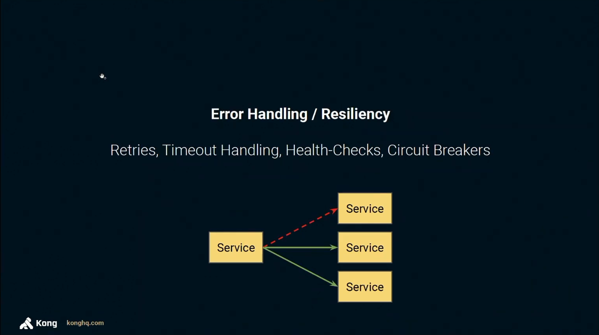

同样如果我们的服务不再运行的时候，此时我们需要进行异常处理
我们需要能够将请求到这些不工作的实例或者服务的通信打断。所以在这里我们需要断路器和health check

在单体服务架构下，我们没有必要非要设定断路器或者是health check
但当规模达到一定程度例如跑一千个单体应用的时候，它们就变得极为重要
如果从一开始我们没有这么做，那么我们在过渡到微服务这条路上就会变得岌岌可危

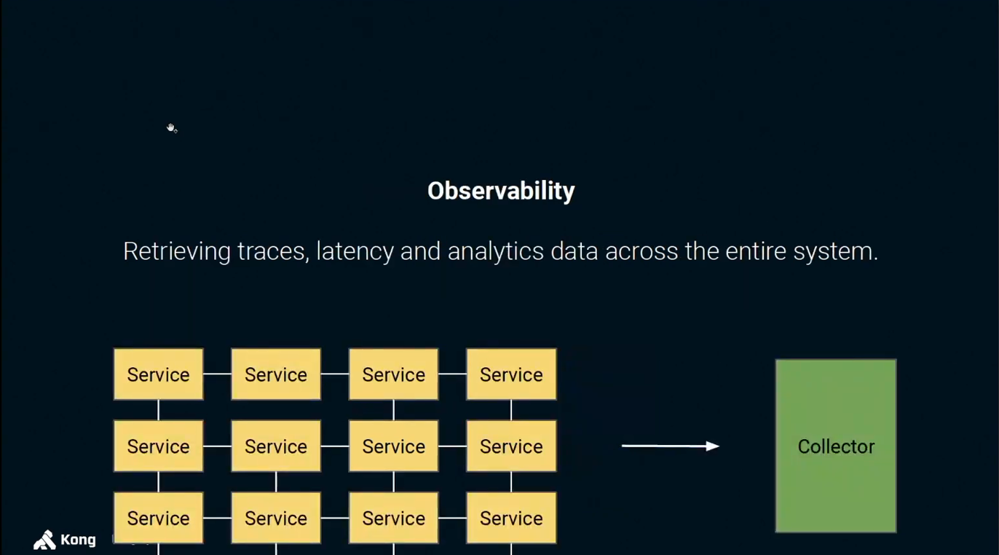

同样，可观测性也和之前在单体架构服务中不同
在单体架构中，我们不需要关心请求会去向哪里（因为很明确）, 但是现在在微服务架构中，我们必须知道

因为我们需要能够去定位我们微服务架构中的薄弱环节
所以我们需要追踪从一个服务到另一个服务的请求，以及收集性能指标和日志
这样才能便于我们理解在任何时候微服务做了什么，以及如果出现问题的话，定位出错的位置

在没有确定服务边界的情况下，很难去向微服务过渡
因为在某一点上不可避免地会出现问题，而我们将无法使用合适的工具来挖掘并找到问题所在

## Service Mesh Pattern

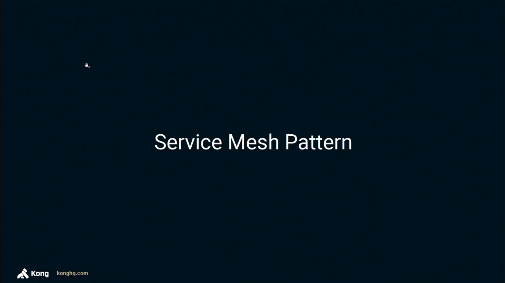

让我们接着讨论Service Mesh

首先，Service Mesh并不是一种技术，而是一种设计模式，我们可以通过各种各样不同的方式来实现Service Mesh

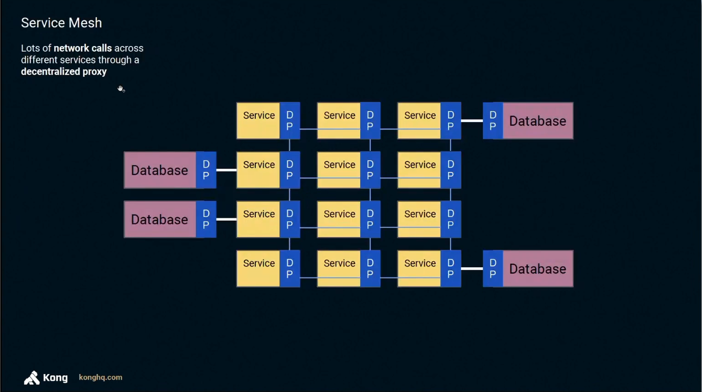

但是通常，我们会有一个代理与我们的服务一起运行，通过这些代理可以将不可靠的网络变得可靠

基于此，我们在构建我们的服务时就不需要担心如何处理延迟问题、observability(可观测性)和双向的TLS等等

因为连接点不再是服务到服务，而是Data Plane（DP,数据平面）到 Data Plane

这些点通过外部网络进行联系，其实就是这些连接点通过Data Plane进行通信

同时，由于Data Plane可以在服务无感知的情况下执行逻辑，那么我们可以在此进行异常，延迟以及可观测性处理

在一个Service Mesh中，Data Plane既是代理也是反向代理，这取决于请求的去向

例如，如果这个服务想要调用那个服务，那么这个Data Plane将作为一个代理
因为（这个）服务正进行的请求将通过那个Data Plane进行代理

但是当那个Data Plane收到请求，那个Data Plane将充当一个反向代理，它将接收请求并将其代理到与之关联的服务

我们需要有一个Data Plane，我们可以通过不同的方式来实现Service mesh
每个底层虚拟机或者每个你正在运行的服务的副本都可以拥有一个Data Plane

后者被称为Sidecar循环代理，因为我们将为每一个服务器上的服务实例提供一个Data Plane实例

这里会有一个观点，不论我们每个副本拥有一个Data Plane，还是每个底层虚拟机拥有一个Data Plane都是一样的
这个观点就是，每当有一个服务到服务的通信，首先会将通信转到Data Plane，然后由Data Plane接收

这些服务不再是直接相互通信，而是必须通过这个不一样的系统（Data Plane）
这允许我们在Data Plane中实现额外的逻辑，也就是说服务无感知是最好的
因为所有双向TLS、所有的可观察性操作都是开箱即用的，团队无须在服务中构建它们

如你所见，这些Data Plane作为联系点，通过这些连接点我们可以做很任何事
包括将数据库纳入这个系统管理中。也是因为当一个服务使用数据库时，我们仍然想要这个使用过程进行观察
我们仍希望拥有Data Plane提供的所有功能，这样一切都将通过Data Plane进行交流

因此，我们通过分散代理在不同服务中进行着大量的网络调用

之所以被称为分散式，是因为不像传统的ESB那样，我们没有将代理实例中心化，而是分散到各个服务中

## Kubernetes的定义

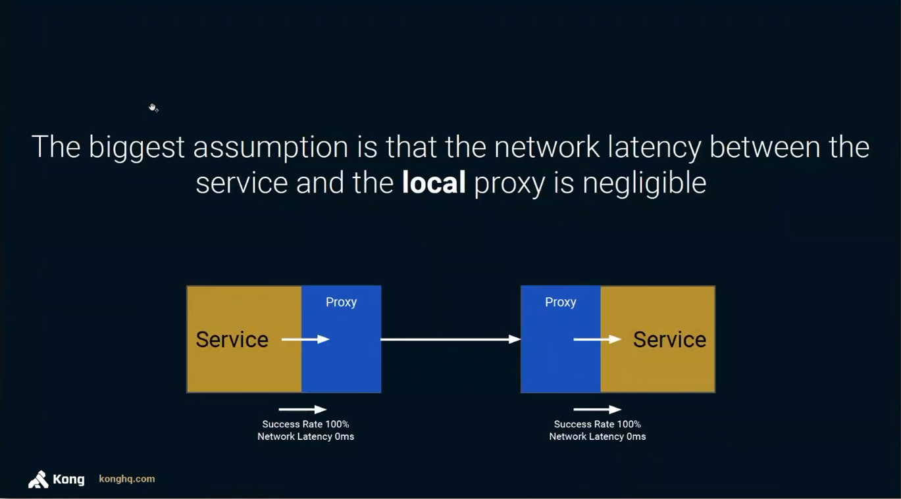

so，我刚才提到的Sidecar代理，这会我们应该知道它是什么了吧。接下来，我们回到关于Kubernetes的定义上来

Kubernetes将我们在底层虚拟机上部署Pods的方式进行了抽象

我们通过使用kubernetes来把我们的虚拟机群变得看起来就像一台主机来使用

Kubernetes将决定这些Pods的去向

当我们告诉kubernetes我希望这个代理是一个sidecar容器

对于这种指定服务容器的其他pods来说
我们告诉kubernetes我想要将这个代理部署在这些服务所在的底层虚拟机上（即每一个服务所在的pod中都有一个sidecar容器）

我们希望Sidecar代理始终部署在底层虚拟机上，因为我们希望服务和代理之间的通信始终在localhost上（适用于每一个副本）

假设是因为在localhost中它（通信）的成功率总是100%

因为我们没有离开这里（进入到外部网络）而是一直在虚拟机中

在这里和那里之间的网络问题将由Data Plane处理
（译者特别说明：sidecar是用于Kubernetes的，而Data Plane用于service mesh两者所处位置不同，请注意）

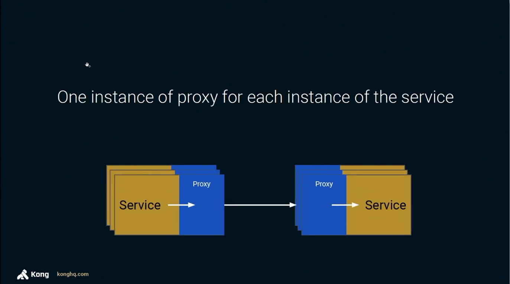

我们将拥有该代理的一个实例，融合了我们服务的每个实例的Sidecar模型

现在，这增加了Data Plane中的问题，Data Plane真的要保持很小的资源利用率，并且在占用上必须非常小

因为我们将在我们的系统中为每个服务的每个副本都运行一个（代理）
这意味着如果代理本身消耗了许多资源，我们将耗尽内存资源（例如在底层虚拟机中）

所以如果我们采用的循环代理越多，我们就要确保这个代理非常非常小，资源占用很小

顺便说一下，对于我们自己的服务同样如此，不能占用太多的内存
否则，要么我们运行在非常大（内存）的虚拟机，要么我们将很快耗尽内存

因此，在资源利用方面，服务和代理都必须非常的小

这也是为什么不能将ESB放在那里的原因

你可以想象为每个服务实例运行一个ESB实例，你的服务就甭指望工作了

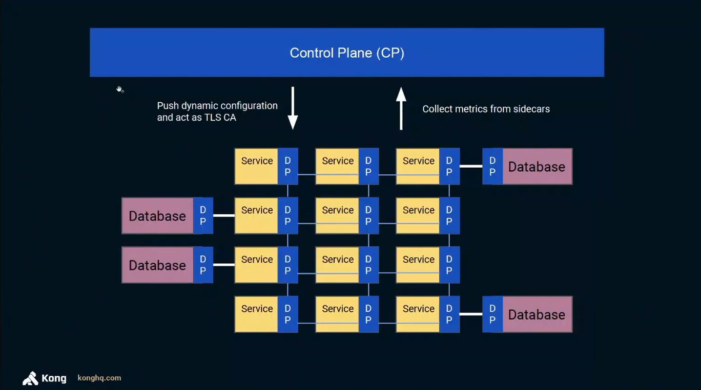

现在，我们希望这些不同的服务都运行在不同的Data Plane上，然后我们需要尽快对这些Data Plane进行配置

当我们的服务在进行通信的时候，其实就是这些Data Plane在依赖我们设定的协议证书进行交流
从整体来看，整个协议很复杂，我们自己很难去和它们做交流（我们需要做很多潜在准备，一不小心就容易出问题）

所以，我们不希望通过人工的方式来将配置推送到这些不同的Data Plane上

这里我们说的就是Control Plane（控制层）了

Data Plane和Control Plane在网络层处理这块儿是非常非常有名的

（例如）你在数据中心运行了一堆Cisco交换机，并且你想要将你的配置推送到这些Casco交换机上

于是我们想要一个可以允许我们这样做的Control Plane

把相同的概念应用到软件上来

我们通过一个Control Plane把配置推到每一个Data Plane中

或者是这个Control Plane可以让Data Plane从一个统一的地方获取这个配置

但它也可以成为我们收集指标（运行参数）的一种方式

现在，Data Plane正在一次性收集所有的这些流量（通信行为）
我们希望有一个组件，允许我们收集日志、收集指标，并且仍然是在Control Plane上

Data Plane位于请求的执行路径上

Control Plane仅用于配置，它仅用于获取这些指标，Control Plane它永远不会在我们的API请求的执行路径上

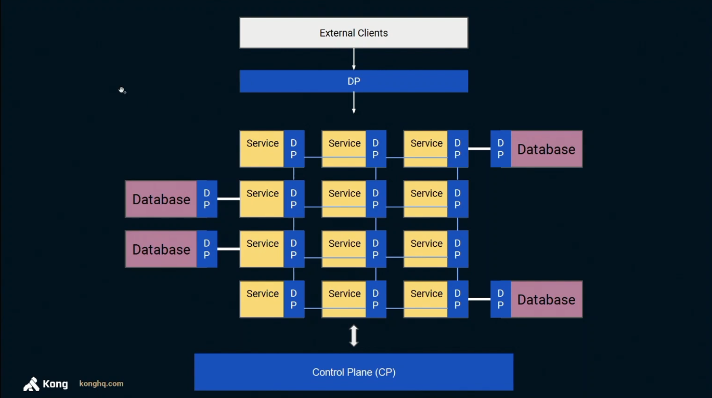

基本上，我们的north-south gateway只是成为了另一种Data Plane，是另外一种代理
它不是我们的Data Plane，但是允许我们与底层Data Plane进行通信

因为它们都是这个Mesh中的一部分，我们可以在这些不同的Data Plane间强制实施双向TLS，确保我们的系统受到保护

即便没有service mesh我们依然可以做这些事情，那这样的话，我们就不得不在自己的服务中通过构建来做这些事儿了

从技术上来讲，微服务并不一定要必须通过Service mesh来做。但问题在于，如果你想拥有这些优点，就必须自己构建它们

并且在service mesh中也不一定需要Kubernetes，但service mesh的理念能够应用于任何平台

kubernetes 只是让我们更容易大规模地运行微服务，但没有什么能阻止我们跨虚拟机来运行service mesh

我们只需要在服务运行的虚拟机上部署我们的data plane实例，这样我们就拥有了一个跑在虚拟机上的service mesh

事实上，我们更想要的是service mesh能够运行在Kubernetes 中

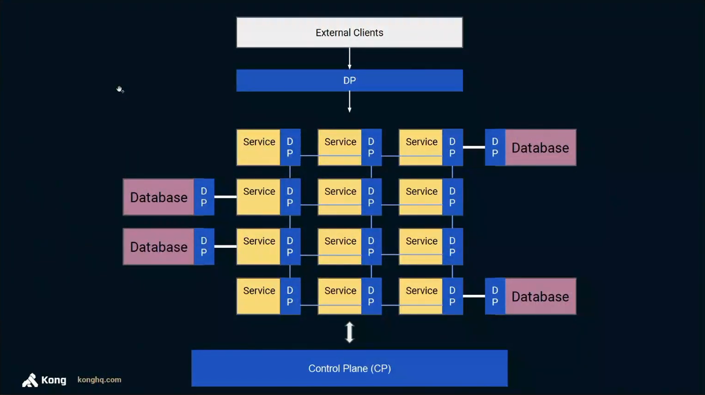

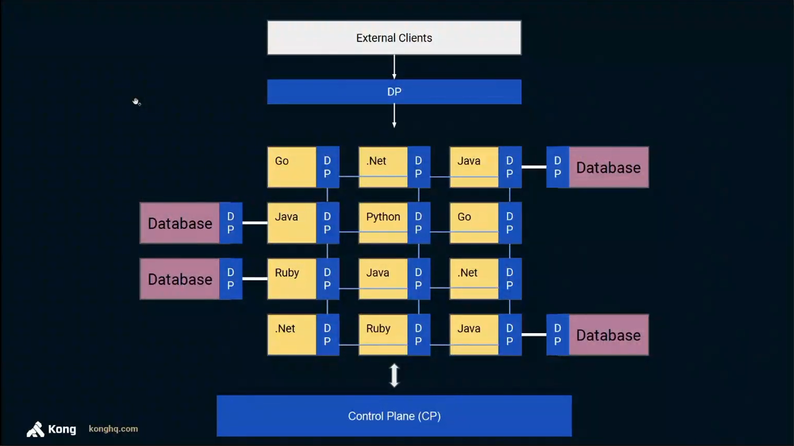

但就像之前说的，我们目前依旧有单体应用运行在虚拟机或遗留的平台上

并希望它通过某种方式能够成为serivce mesh中的一部分
所以我们希望数据平台不仅仅是在kubernetes 中，还要运行在我们单体应用的环境中

我们希望这种模式（上述的单体应用）也可以成为service mesh的一部分

如果你想让转移到微服务变得更加实际，那么平台无关性无疑是非常重要的

就像之前说的，不同的服务可以建立在不同的语言上，这就是微服务的优势之一

因为我们可以将依赖性很小和功能独立的服务构建在data plane上，这意味着我们不用重复的去做相同逻辑的事了

在两种不同的技术编写的两个微服务中，data plane就属于一个对外处理的代理，它和对应的微服务一起运行在同一个虚拟机中

## 基于事件的架构

我再花点时间来谈下基于事件的架构

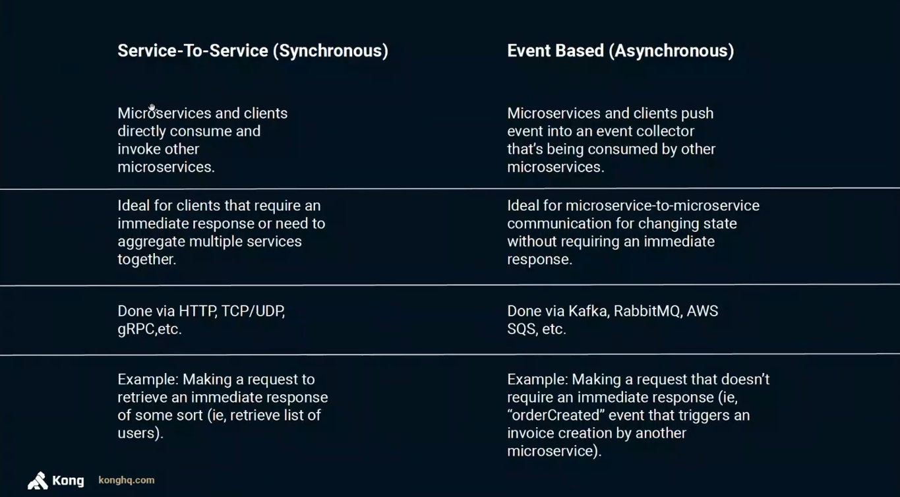

当我们讨论 service mesh ，即在讨论微服务时，通常会讨论服务之间的通信，但这不是实现这些系统的唯一方式

还有另一种方式是采用基于事件的体系结构来创建它们

这意味着，我们将在架构中传播一个事件，用更有效的方式来处理诸如捕获状态之类的事情

这里假设有两个不同的微服务，一个做订单和一个开发票

每次我们创建订单，再开一张发票，听起来不错

但是，如果一些原因导致发票微服务变得不可用了，我们会继续重试直至请求超时

最终发票不会被创建成功，当然最好不要出现这种情况

如果它真的发生了，那么系统中状态的传播就会被中断，事后需要花很大的代价去修复

因此对于上述案例用状态进行传播的方式，我们可以考虑使用事件

例如让发票的微服务就绪之后再去处理订单创建事件，这样我们的状态就不会丢失了

这种方式的风险在于，我们可以用例如kafka之类的当做事件收集器，但系统中的其他服务可能真的会发生一些异常情况

所以希望在这些服务前面有一个data plane，因为我们想要确保服务事件能够到达事件收集器（kafka）

所以我们可以采用Kafka或某种日志收集器来处理我们的一些用例，当然必须确保日志收集器可用，不会发生故障

通常我们更容易将精力用于保证一项服务的正常运行（例如日志收集），而不是将它放在给每个服务传播状态信息上

因为我们只有一个组件的话只需要确保它能正确持续运行，相反，如果组件很多，那么所有的组件都必须处于正常运行
我们可以集中精力让运行变得更加可靠一点，使得状态的传播也变得更加可靠

就像我所说的企业组织架构正在转变，而我们的系统也逐渐往一个复杂的生命体方向靠拢，因此我很喜欢用神经系统来做比喻

我们的身体由大脑中的CNS(中枢神经系统)和PNS(周围神经系统)两个不同组成部分组成

周围神经系统将我们身体能够理解的所有信息存起来，然后将它们传递给CNS(中枢神经系统),以便CNS(中枢神经系统)可以处理它们

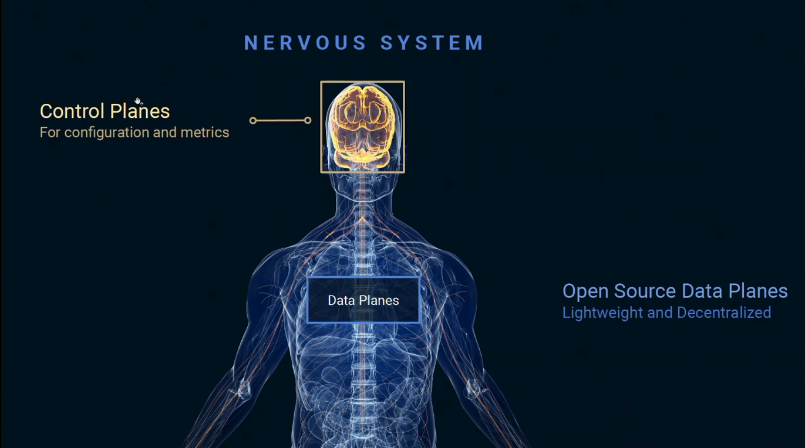

这与 control plane 和 data plane 的概念非常相似

data plane将位于我们每个服务，每个单体应用的外围，以及每个函数式（例如lambdas）的外围

但是相关配置，监控以及可观察性，都将由control plane处理

## Kong做了什么

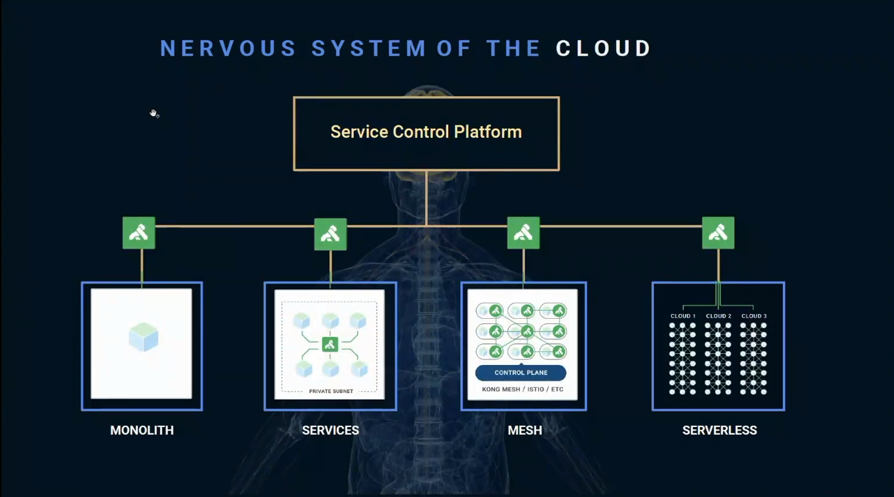

我之前说过 我是Kong的联合创始人兼CTO， Kong提供了一个有效地开源 control plane和data plane，可以允许在组织中进行不同架构的管理

在全球范围内运行着超过一百万的Kong实例来帮助开发者进行data plane管理
我们给那些需要进行架构转变的团队提供了技术支持以帮助他们从单体架构到微服务到 Service Mesh 到Serverless的过渡

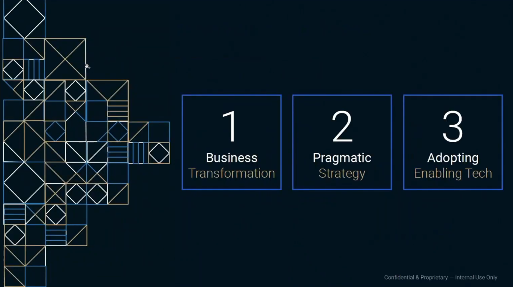

过渡到微服务是一个很复杂的课题，因为它影响了三个不同的方面

但更重要的是我们必须将这个过程和我们要达成的业务目标相结合，不然就像我说的，它只是依葫芦画瓢，为了使用微服务而微服务

首先是业务转型

我们必须实事求是，如果没有必要，我们不需要立马转型微服务或者立即拥有数千个微服务

主要在于我们总是有时间来将服务变得越来越小

因此，不必那么着急，先将服务提取到中等大小，然后随着时间的推移使其变得更小

事实上，我想说只有当服务需要变得更小的时候，那么我们才能将它变得更小。这才是最好的过渡方式

因为它既可以提高我们的生产力，也增强了我们的业务

通过采取使用技术的方式，使我们能够向这些新架构微服务过渡

但也可通过一个非常务实的方式连接现在正在提供业务服务的老应用程序（程序待重构）

那些仍然是最关键的组件，将它们与我们新的greenfield （新开发的）微服物架构连接起来，这将成我们系统的未来

所以这需要在新旧之间建立联系

感谢大家的倾听

## 提问

所以你们还有其他问题吗？

提问部分：就比如说又一个单体应用，按照演讲者之前讲的意思将服务逐步解耦使之变得越来越小
Amazon就表示对他们来说这样做就会代价很大，于是他们就中途放弃
直接重新开始，直接开始全面微服务（抛弃原有的系统），对此你有什么看法

就像我说的，这其实也是一种选择。只要企业/开发团队已经准备好能做全面微服务化的准备
同时也有着清晰的思路，那么这种过渡到微服务的方案也是可取的

在采用那个方案的时候，我们必须分析利弊。当然，Amazon通过分析他们的利弊
如果选择重新打造而不是从单体应用慢慢过渡到微服务，这种情况下，利远大于弊

在我看来，它仍然是一个很少有公司能够成功过渡到微服务的策略

当然这些事情我们也需要纳入考虑

提问部分大致意思：微服务间存在着大量的调用
然而我们通过Data Plane进行网络通信的延迟远高于服务与服务之间的本地调用，有没有什么降低延迟的办法？

系统可以为我们提供指标，用以了解延迟瓶颈的正确位置
所以如果我们需要通过网络，我们将得到比通过本地函数调用更多的延迟，这是可行的

实际上，如果代理没有正确建立，这个网络处理就会增加更多的延迟

因为你知道的双向TLS 以及可观测性操作都会在我们的处理过程中增加延迟

所以我们可以做的就是在Data Plane层缓存一些信息，这样请求可能就不需要进入到外部网络中，所以我想到的是
在这些不同的服务间组织实现某种意义上的全局缓存，假设这的方式是可行的，因为对于某些用例（场景）我们是无法实现（缓存）的

而对于其他人而言，他们完全接受了最终一致架构的概念，延迟只是它的一部分

并且客户端就是这样建立起来的，他们考虑到了这一点，所以一切最终都是一致的，会有一点延迟
我们将在客户端看到信息，它不一定是最新的，但它最终会保持一致

在考虑延迟问题的时候，Service mesh能够通过一系列方法来帮助我们定位延迟问题，这不仅仅只是网络延迟，同样也可能是服务延迟

我们为了能够确定是否必须对那些已经对其他服务产生性能瓶颈的服务进行升级，所以需要一种观察的机制
这样在实际使用中，这也能让我们实现一些缓存方法去提高我们架构的性能

当然，因为我们是基于网络去请求，所以我们应该从实际出发
去分辨哪些延迟是正常的，哪些是不正常的。如果不正常
那么我们就必须确保系统的最终一致性，并以此为前提，我们来构建我们的客户端
